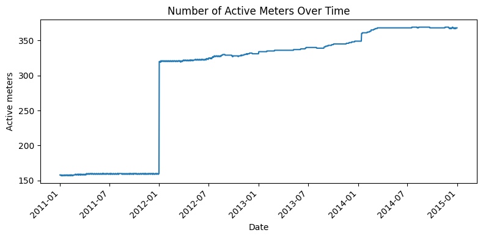
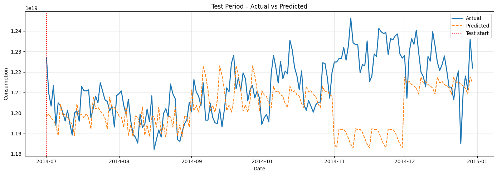

# Electricity Consumption Forecasting – Time Series Modeling

## 1. Objective

The objective of this project is to build a **scalable, production-ready time-series forecasting solution** to predict **daily electricity consumption** for multiple meters using historical data.

Key goals:

* Forecast daily electricity consumption for future periods (next 30 days)
* Handle hundreds of meters efficiently using a **single global model**
* Design a **leakage-safe** data processing and feature engineering pipeline
* Compare multiple modeling approaches and select the most robust model

---

## 2. Dataset Overview

* **Source:** Electricity consumption readings from individual meters
* **Granularity:** 15-minute intervals
* **Coverage:** ~370 meters over multiple years
* **Raw Format:** Wide CSV (timestamp × meter columns)
* **Final Modeling Granularity:** Daily × Meter
### Active meters over time


---

## 3. Data Processing Pipeline

### 3.1 Raw Data Ingestion

* Read semicolon-separated CSV file
* Parse timestamp column
* Identify meter columns (`MT_*`)

### 3.2 Reshaping & Cleaning

* Convert wide format → long format (`timestamp × meter_id`)
* Convert consumption values to numeric (handle commas and missing values)
* Extract `Date` and `Month`

### 3.3 Daily Aggregation

* Aggregate 15-minute readings to daily consumption per meter
* Compute diagnostics:

  * Number of intervals per day
  * Number of missing readings

### 3.4 Meter Activation Handling

* Identify first active date per meter (`daily_consumption > 0`)
* Remove meters that never became active
* Retain only **post-activation days** to avoid artificial zeros

---

## 4. Feature Engineering

### 4.1 Temporal Features

* Day of week
* Weekend indicator
* Month of year

### 4.2 Seasonality Indexes (Train-only)

To explicitly model recurring patterns:

* Day-of-week seasonality index 
    DOW seasonality index = (mean consumption on DOW) / (overall mean consumption)
* Month-of-year seasonality index
    (mean consumption in month) / (overall mean consumption)

These are computed **using training data only** to avoid information leakage.

---

### 4.3 Lag-Based Features (Month-Anchored)

Lag features are computed using **historical data available as of the start of each month**, and then held constant within that month.

Lag statistics include:

* Mean, standard deviation
* Lower and upper quantiles
* Multiple windows: short-term, medium-term, seasonal, and annual

This design:

* Prevents target leakage
* Enables stable multi-day forecasting
* Reduces daily noise in features

---

### 4.4 Missing Value Handling

* Lag features imputed using **training-period statistics only**
* Median imputation with global fallback
* Missingness handled safely for all models

---

## 5. Feature Selection Strategy

A funnel-based feature selection approach is applied using **training data only**:

1. Remove features with high missing percentage
2. Remove low-variance features
3. Remove features with weak correlation to the target
4. Remove highly correlated feature pairs (retain the one with stronger target correlation)

This ensures:

* Reduced multicollinearity
* Faster training
* Better generalization

FINAL_FEATURES = [
    # ---- Calendar / seasonality ----
    "month",
    "dow",
    "is_weekend",
    "dow_seasonality_index",
    "month_seasonality_index",

    # ---- Short-term memory ----
    "lag_mean_7d",
    <!-- "lag_std_7d", -->

    # ---- Medium-term memory ----
    "lag_mean_30d",
    "lag_std_30d",
    "lag_p80_30d",

    # ---- Seasonal memory ----
    "lag_mean_90d",
    "lag_std_90d",
    "lag_p10_90d",

    # ---- Long-term / annual baseline ----
    "lag_mean_365d",
    "lag_std_365d",
    "lag_p10_365d",
]

---

## 6. Train / Validation / Test Split

* **Train:** Historical data
* **Validation:** Random 15% sample from training period
* **Test:** Strictly future time period

Validation is used for:

* Model comparison
* Hyperparameter tuning
* Overfitting checks

---

## 7. Why This Approach (vs ARIMA / Prophet)

Classical time-series models such as **ARIMA** and **Prophet** were evaluated but not chosen as the primary approach for the following reasons:

### 7.1 Scalability

* Hundreds of meters would require hundreds of individual models
* Operational complexity increases significantly
* Retraining and deployment become expensive

A **global ML model** scales efficiently across meters.

---

### 7.2 Feature-Rich Forecasting

Electricity demand depends on:

* Short-, medium-, and long-term usage patterns
* Calendar effects
* Seasonal intensity

Tree-based ML models naturally handle:

* Nonlinear relationships
* Feature interactions
* High-dimensional engineered features

---

### 7.3 Multi-Step Forecast Stability

* Recursive ARIMA-style forecasts accumulate error
* Month-anchored lag features enable stable multi-day forecasting
* ML models adapt better to recent behavioral shifts

---

### 7.4 Production Readiness

The chosen approach enables:

* Faster retraining
* Easier feature updates
* Consistent validation framework
* Simple integration into downstream systems

---

## 8. Models Implemented

Four models were trained using a unified framework:

1. **Linear Regression (OLS)** – `statsmodels`
2. **Random Forest Regressor** – `sklearn`
3. **Gradient Boosting (GBM)** – `HistGradientBoostingRegressor`
4. **XGBoost** – optional (environment-dependent)

All models:

* Use the same feature set
* Produce predictions for train and test sets
* Store predictions in separate dataframe columns

---

## 9. Target Transformation & Metrics

### 9.1 Log Transformation

The target variable is modeled as:

```
log1p(daily_consumption)
```

Predictions are transformed back using:

```
expm1(prediction)
```

This stabilizes variance and improves relative accuracy, especially for low-consumption days.

---

### 9.2 Evaluation Metrics

Metrics are computed separately for **train and test** datasets:
* Train time period is (2012-07-01, 2014-06-30) and test time period is considered (2014-07-01, 2014-12-31)
* **R-squared (R²)** – on log scale
* **Mean Absolute Error (MAE)** – original scale
* **Weighted Absolute Percentage Error (WAPE)** – primary percentage metric

> MAPE is intentionally avoided due to instability caused by near-zero consumption values.

---

## 10. Model Performance Summary

| Model             | Split | R²         | WAPE       |
| ----------------- | ----- | ---------- | ---------- |
| Linear Regression | Test  | ❌ Negative | ❌ Unstable |
| Random Forest     | Test  | ~0.88      | ~13%       |
| Gradient Boosting | Test  | ~0.88      | ~16%       |
| XGBoost           | Test  | ~0.85      | ~16%       |

---

## 11. Key Insights

* Electricity consumption exhibits strong **nonlinear behavior**
* Lag-based features are the strongest predictors
* Explicit seasonality indexes improve generalization
* Linear regression fails due to inability to capture interactions
* Tree-based models significantly outperform linear baselines

---

## 12. Model Performance

| Model                       | Split |    R² |     MAE |    WAPE |
| --------------------------- | ----- | ----: | ------: | ------: |
| Linear Regression (OLS)     | Train | -5.73 | 1.68e30 | 5.13e13 |
| Linear Regression (OLS)     | Test  | -7.65 | 8.17e28 | 2.49e12 |
| Random Forest               | Train | 0.966 | 3.47e15 |   0.106 |
| Random Forest               | Test  | 0.872 | 4.38e15 |   0.134 |
| Gradient Boosting (sklearn) | Train | 0.980 | 3.80e15 |   0.116 |
| Gradient Boosting (sklearn) | Test  | 0.876 | 5.28e15 |   0.161 |
| XGBoost                     | Train | 0.978 | 3.05e15 |   0.093 |
| XGBoost                     | Test  | 0.853 | 4.85e15 |   0.148 |


**Gradient Boosting (sklearn GBM)** is selected as the final model due to:

* Strong generalization performance
* Stable error metrics
* Better representation of daily forecast compared to random forest
* Suitability for production deployment


---

## 13. Feature Importance

Feature importance is computed per model using:

* **OLS:** absolute t-statistics
* **Random Forest / XGBoost:** built-in feature importance
* **GBM:** permutation importance

Lag-based (7 day average demand and 30 day average demand) and seasonality features consistently rank highest.

---

## 14. Project Structure

```
├── data/
│   └── LD2011_2014.txt
├── scripts/
│   ├── data_prep.py
│   ├── feature_creation.py
│   ├── config.py
│   └── model_building.py
├── notebooks/
│   └── EDA.ipynb
├── README.md
```

---

## 15. Limitations & Future Work

* Add prediction intervals (quantile regression or bootstrapping)
* Perform meter-level residual diagnostics
* Explore ensembling (RF + GBM)
* Extend to aggregate load forecasting
* Hyperparameter optimization

---

## 16. Conclusion

This project demonstrates a **robust, scalable, and leakage-safe approach** to electricity consumption forecasting.
By leveraging global machine-learning models with carefully engineered features, the solution balances **accuracy, interpretability, and production readiness**.

---

